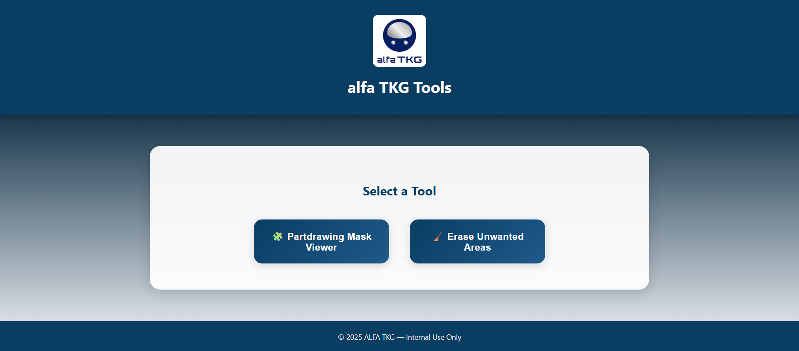

# 🧠 Partdrawing Mask Viewer

An **interactive web application** built with Flask that visualizes engineering part drawings along with their segmentation mask overlays.  
Users can upload ZIP files containing *noisy images* and *corresponding `.npy` mask files*, preview overlays, and explore each mask interactively.

---

## 🚀 Features

- 📂 Upload two ZIP files: one containing noisy images, and one with `.npy` mask arrays.  
- 🧩 Automatic image–mask matching using filename normalization.  
- 🎨 Overlay visualization with unique colors for each mask.  
- 🖱️ Hover interaction: highlights the active mask region and displays its ID.  
- 🔄 Navigation buttons for browsing multiple images.  
- 💡 Error handling with clear messages and progress indication.  

---

## 🖼️ Application Preview

### 🔹 Upload Page

  

### 🔹 Mask Visualization

  

---

## 🏗️ Project Structure

PartDrawing_Mask_viewers-/
│
├── app.py                 # Flask backend server
├── requirements.txt       # Dependencies
├── templates/
│   └── index.html         # Main frontend HTML (UI + JS)
├── static/
│   ├── images/
│   │   └── com logo.jpg
│   ├── uploads/           # Auto-created for temporary uploads
│   └── css/, js/ (optional)
└── README.md

---

## ⚙️ Installation & Setup

1️⃣ **Clone the Repository**
git clone https://github.com/Balamurugan245/PartDrawing_Mask_viewers-.git
cd PartDrawing_Mask_viewers-

2️⃣ **Create Virtual Environment (Optional but Recommended)**
python -m venv venv
source venv/Scripts/activate      # On Windows
# or
source venv/bin/activate          # On Linux/Mac

3️⃣ **Install Dependencies**
pip install -r requirements.txt

4️⃣ **Run the App**
python app.py

Then open your browser and go to:  
👉 http://127.0.0.1:5000/

---

## 🧪 Example Workflow

1️⃣ Prepare two ZIP files:  
- **Noisy images ZIP** — contains `.jpg` or `.png` files.  
- **Mask files ZIP** — contains `.npy` arrays for each corresponding image.  

2️⃣ Upload both via the web interface.  
3️⃣ Click **Upload & Preview**.  
4️⃣ Use **Next / Previous** buttons to browse images.  
5️⃣ Hover over regions to see mask details.  

---

## 🧰 Built With

- Flask  
- NumPy  
- Pillow (PIL)  
- HTML5, CSS3, JavaScript  

---

## 📸 Screenshots

| Upload Page | Mask Overlay |
|--------------|--------------|
|  |  |

---

## 👨‍💻 Authors

- **Balamurugan** — [GitHub Profile](https://github.com/Balamurugan245)  
- **Kaviya** — [GitHub Profile](https://github.com/kaviyarajasekaran/Partdrawing_Mask-Viewer)

---
